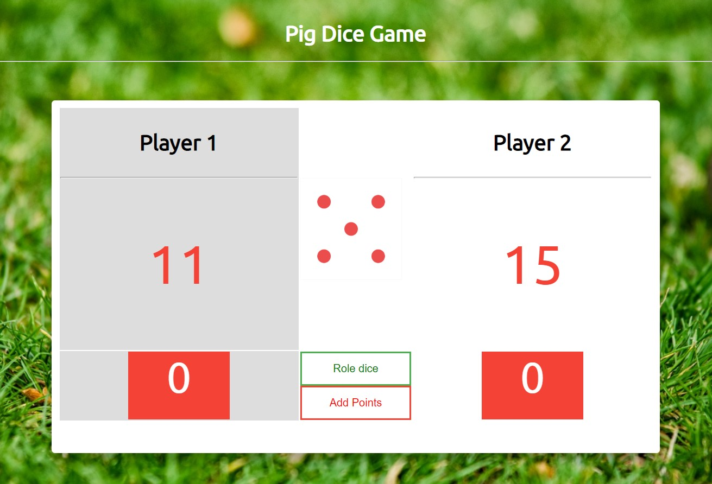

# PIG DICE GAME
Pig Dice game using JavaScript and basic DOM properties. 

# GAME RULES:

<ul>
    <li>
        The game has 2 players, playing in rounds
    </li>
    <li>
        In each turn, a player rolls a dice as many times as he whishes. Each result get added to his ROUND score
    </li>
    <li>
        BUT, if the player rolls a 1, all his ROUND score gets lost. After that, it's the next player's turn
    </li>
    <li>
        The player can choose to 'Hold', which means that his ROUND score gets added to his GLBAL score. After that, it's the next player's turn
    </li>
    <li>   
        The first player to reach 200 points on GLOBAL score wins the game
    </li>
</ul>

# SCREENSHORT

